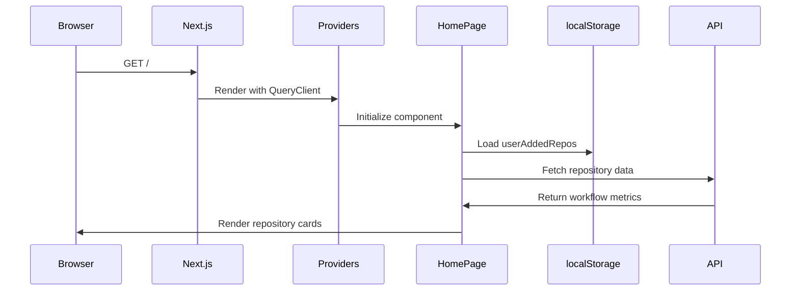
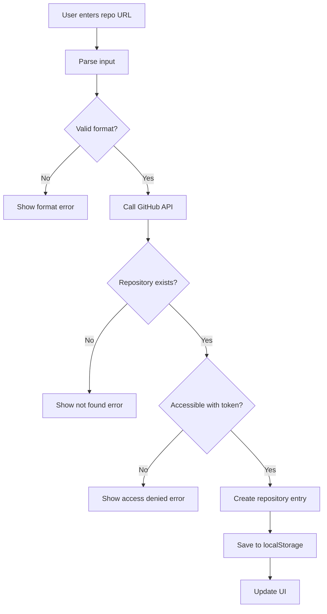
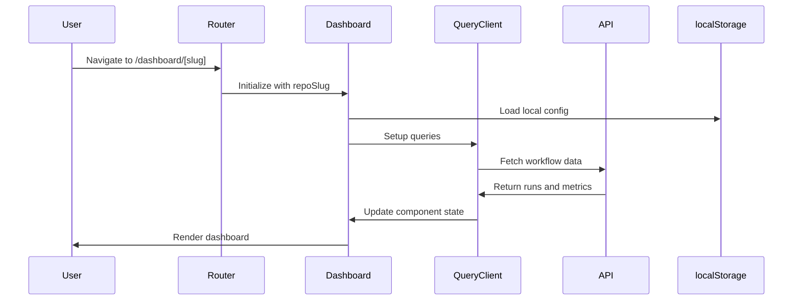
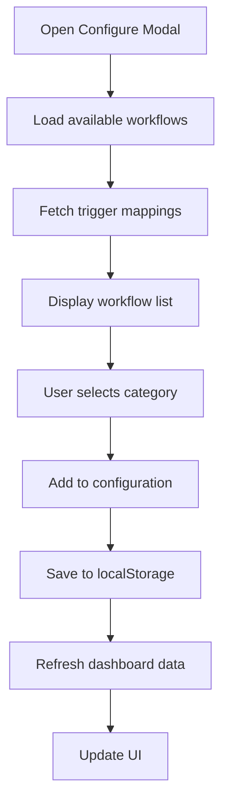

# OmniLens Application Flows Documentation

## Overview

OmniLens is a real-time GitHub workflow monitoring and analytics platform built with Next.js 14, TypeScript, and TanStack Query. This document provides a deep understanding of the application flows from initial page load to repository management and dashboard interactions.

## Table of Contents

1. [Application Architecture](#application-architecture)
2. [Home Page Flow](#home-page-flow)
3. [Repository Addition Flow](#repository-addition-flow)
4. [Dashboard Navigation Flow](#dashboard-navigation-flow)
5. [Data Fetching and Caching](#data-fetching-and-caching)
6. [Workflow Configuration Flow](#workflow-configuration-flow)
7. [Real-time Updates](#real-time-updates)
8. [State Management](#state-management)

## Application Architecture

### Technology Stack
- **Frontend**: Next.js 14 with App Router, React 18, TypeScript
- **Styling**: Tailwind CSS with custom UI components
- **Data Fetching**: TanStack Query (React Query) for caching and real-time updates
- **State Management**: React hooks + localStorage for persistence
- **API**: GitHub REST API v3
- **Runtime**: Bun (Node.js compatible)

### Core Components Structure
```
dashboard/
├── app/
│   ├── layout.tsx          # Root layout with providers
│   ├── page.tsx            # Home page with repository list
│   ├── dashboard/[slug]/   # Dynamic dashboard routes
│   └── api/                # API routes
├── components/             # Reusable UI components
├── lib/                    # Utility functions and GitHub API
└── config/                 # Workflow configuration
```

## Home Page Flow

### 1. Initial Page Load



### 2. Home Page State Management

The home page manages several key states:

- **Available Repositories**: List of configured repositories
- **Loading States**: For initial load and background updates
- **Error States**: For API failures and validation errors
- **User-Added Repositories**: Local storage for user-added repos

### 3. Repository Card Rendering

Each repository card displays:
- Repository name and avatar
- Workflow metrics (success rate, run counts)
- Error states for inaccessible repositories
- Action buttons (delete for user-added repos)

## Repository Addition Flow

### 1. Repository Validation Process



### 2. Input Validation Logic

The application accepts multiple input formats:
- Full GitHub URLs: `https://github.com/owner/repo`
- Owner/repo format: `owner/repo`
- Repository names with various separators

### 3. API Validation Endpoint

```typescript
// POST /api/repositories/validate
{
  repoUrl: string;
}

// Response
{
  valid: boolean;
  repoPath: string;      // owner/repo
  displayName: string;   // Formatted name
  htmlUrl: string;       // GitHub URL
  defaultBranch: string; // Default branch
}
```

## Dashboard Navigation Flow

### 1. Dashboard Page Initialization



### 2. Dynamic Route Handling

The dashboard uses Next.js dynamic routes:
- Route: `/dashboard/[slug]`
- Parameter: `slug` (repository identifier)
- Supports both environment-configured and user-added repositories

### 3. Repository Configuration Detection

The dashboard detects repository type:
- **Environment-configured**: Uses `workflows.json` configuration
- **User-added**: Uses localStorage configuration
- **Hybrid**: Combines both sources

## Data Fetching and Caching

### 1. TanStack Query Implementation

```typescript
// Main workflow data query
const { data, isLoading, error, refetch } = useQuery({
  queryKey: ["workflowData", repoSlug, date],
  queryFn: () => fetchWorkflowData(date, repoSlug),
  enabled: !!repoConfig || !!addedRepoPath,
  staleTime: isToday ? 0 : 5 * 60 * 1000,
  refetchInterval: isToday ? 10000 : false,
  refetchOnWindowFocus: isToday,
});
```

### 2. Caching Strategy

- **Today's Data**: No cache, real-time updates every 10 seconds
- **Historical Data**: 5-minute cache for performance
- **Background Updates**: Only for today's data when tab is visible
- **Manual Refresh**: Available for immediate updates

### 3. API Endpoint Structure

```typescript
// GET /api/workflows?date=YYYY-MM-DD&repo=slug
// GET /api/workflows?date=YYYY-MM-DD&repoPath=owner/repo

Response: {
  workflowRuns: WorkflowRun[];
  overviewData: {
    completedRuns: number;
    inProgressRuns: number;
    passedRuns: number;
    failedRuns: number;
    totalRuntime: number;
    didntRunCount: number;
    totalWorkflows: number;
    missingWorkflows: string[];
  };
}
```

## Workflow Configuration Flow

### 1. Configuration Modal



### 2. Workflow Categorization

Workflows are organized into four categories:
- **Build**: Compilation and packaging workflows
- **Testing**: Test suites and quality checks
- **Trigger**: Event-driven workflows
- **Utility**: Helper and automation workflows

### 3. Trigger Mapping System

The application automatically detects trigger-testing relationships:
- Analyzes workflow files for trigger patterns
- Maps trigger workflows to their testing workflows
- Provides visual indicators for trigger workflows
- Enables automatic review state management

## Real-time Updates

### 1. Polling Strategy

```typescript
// Background polling for today's data
useEffect(() => {
  if (!isSelectedDateToday) return;
  
  const intervalId = setInterval(() => {
    if (document.visibilityState === 'visible') {
      refetchToday();
    }
  }, 10000);
  
  return () => clearInterval(intervalId);
}, [isSelectedDateToday, refetchToday]);
```

### 2. Update Triggers

- **Time-based**: Every 10 seconds for today's data
- **Focus-based**: When user returns to tab
- **Manual**: User-initiated refresh
- **Background**: Limited to visible tabs

### 3. Data Synchronization

- **Query Invalidation**: Automatic cache invalidation
- **Optimistic Updates**: Immediate UI feedback
- **Error Handling**: Graceful degradation on API failures
- **State Persistence**: localStorage for user preferences

## State Management

### 1. Local Storage Structure

```typescript
// User-added repositories
localStorage.setItem('userAddedRepos', JSON.stringify([
  { slug: 'local-owner-repo', repoPath: 'owner/repo', displayName: 'Repo Name' }
]));

// Repository configuration
localStorage.setItem(`localRepoConfig-${repoSlug}`, JSON.stringify({
  slug: repoSlug,
  categories: {
    build: { name: 'Build Workflows', workflows: [] },
    testing: { name: 'Testing Workflows', workflows: [] },
    // ...
  }
}));

// Review states (per date)
localStorage.setItem(`reviewedWorkflows-${repoSlug}-${date}`, JSON.stringify({
  [workflowId]: boolean
}));
```

### 2. React State Hierarchy

```typescript
// Component-level state
const [selectedDate, setSelectedDate] = useState<Date>(new Date());
const [reviewedWorkflows, setReviewedWorkflows] = useState<Record<number, boolean>>({});
const [collapsedCategories, setCollapsedCategories] = useState<Record<string, boolean>>({});

// Query state (managed by TanStack Query)
const { data, isLoading, error } = useQuery({...});
```

### 3. State Persistence Strategy

- **User Preferences**: localStorage for review states, collapsed categories
- **Configuration**: localStorage for user-added repositories
- **Cache**: TanStack Query for API responses
- **Session**: React state for temporary UI state

## Error Handling and Edge Cases

### 1. API Error Scenarios

- **Rate Limiting**: GitHub API rate limit exceeded
- **Authentication**: Invalid or expired GitHub token
- **Authorization**: Repository access denied
- **Network**: Connection failures and timeouts

### 2. Data Validation

- **Repository Validation**: Ensures repository exists and is accessible
- **Workflow Validation**: Validates workflow file configurations
- **Date Validation**: Ensures valid date formats and ranges
- **Configuration Validation**: Validates workflow categorization

### 3. Fallback Mechanisms

- **Empty States**: Graceful handling of no workflows
- **Loading States**: Skeleton components during data fetch
- **Error Boundaries**: Component-level error handling
- **Retry Logic**: Exponential backoff for failed requests

## Performance Optimizations

### 1. Caching Layers

- **Browser Cache**: HTTP cache headers for static assets
- **Query Cache**: TanStack Query for API responses
- **Local Storage**: User preferences and configurations
- **Memory Cache**: In-memory cache for frequently accessed data

### 2. Data Fetching Optimization

- **Pagination**: Efficient GitHub API pagination
- **Selective Updates**: Only fetch changed data
- **Background Sync**: Non-blocking data updates
- **Request Deduplication**: Prevent duplicate API calls

### 3. UI Performance

- **Virtual Scrolling**: For large workflow lists
- **Lazy Loading**: Components loaded on demand
- **Memoization**: React.memo for expensive components
- **Debouncing**: User input debouncing

## Security Considerations

### 1. GitHub Token Management

- **Environment Variables**: Secure token storage
- **Token Permissions**: Minimal required scopes
- **Token Rotation**: Support for token updates
- **Access Validation**: Repository access verification

### 2. Input Sanitization

- **Repository URLs**: Validation and sanitization
- **User Input**: XSS prevention
- **API Parameters**: Parameter validation
- **Configuration Files**: JSON schema validation

### 3. Data Privacy

- **Local Storage**: User data stays local
- **API Calls**: No sensitive data transmission
- **Error Logging**: Sanitized error messages
- **Access Control**: Repository-level access validation

## Monitoring and Debugging

### 1. Logging Strategy

```typescript
// Structured logging for debugging
console.log(`🔄 [${timestamp}] Fetching data for ${dateStr} from repo ${repoSlug}...`);
console.log(`✅ [${timestamp}] Received data: ${data.workflowRuns?.length || 0} workflow runs`);
```

### 2. Performance Monitoring

- **API Response Times**: Track GitHub API performance
- **Cache Hit Rates**: Monitor caching effectiveness
- **User Interactions**: Track user engagement
- **Error Rates**: Monitor application stability

### 3. Debug Tools

- **React DevTools**: Component state inspection
- **Network Tab**: API call monitoring
- **Console Logs**: Detailed debugging information
- **Error Boundaries**: Error tracking and reporting

## Future Enhancements

### 1. Planned Features

- **Multi-repository Dashboards**: Unified view across repos
- **Advanced Analytics**: Trend analysis and predictions
- **Webhook Integration**: Real-time GitHub webhooks
- **Team Collaboration**: Shared review states

### 2. Performance Improvements

- **Service Workers**: Offline support
- **GraphQL**: More efficient data fetching
- **WebSockets**: Real-time updates
- **CDN Integration**: Global content delivery

### 3. User Experience

- **Dark/Light Mode**: Theme preferences
- **Customizable Layouts**: User-defined dashboard layouts
- **Export Functionality**: Data export capabilities
- **Mobile Optimization**: Responsive design improvements

---

This documentation provides a comprehensive understanding of the OmniLens application flows. Each section can be used as a reference for development, debugging, and feature planning. The diagrams and code examples illustrate the key processes and help identify areas for optimization and improvement.
