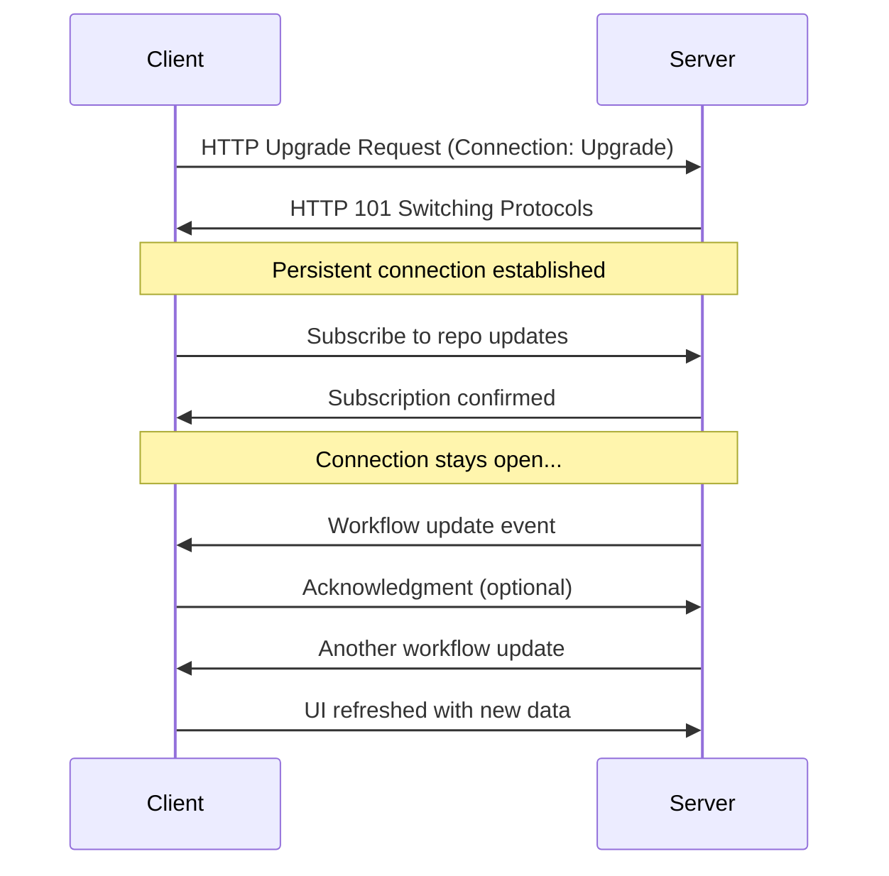
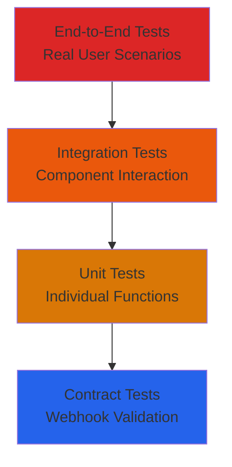

# Real-Time Dashboard Solution: GitHub Webhooks + WebSockets

*Configured for: Next.js API routes, In-memory cache, Environment variables, Real-time delivery, No fallback polling*

## Overview

This document outlines the implementation of a real-time data update system for the OmniLens dashboard that replaces the current inefficient polling approach with GitHub webhooks and WebSocket connections.

## Current Problem

The dashboard currently uses polling to check for new data:
- **10-second polling interval** for today's data
- **Inefficient API usage** consuming GitHub rate limits unnecessarily
- **10-second latency** between data availability and display
- **Network waste** with frequent requests even when no data changes
- **Poor user experience** with delayed updates

## Proposed Solution

Implement a **GitHub Webhooks + WebSockets** architecture that provides instant, real-time updates when workflow events occur.

### Architecture Overview

```mermaid
graph TB
    A[GitHub Repository] -->|Webhook| B[Webhook Handler<br/>Next.js API Route]
    B --> C[Event Processor]
    C --> D[WebSocket Server<br/>Socket.IO]

    D -->|Real-time Updates| E[Dashboard UI<br/>React Components]
    E -->|Subscribe to Repo| D

    B --> F[Cache Store<br/>In-Memory]
    F --> E

    style A fill:#2563eb
    style B fill:#ea580c
    style C fill:#d97706
    style D fill:#059669
    style E fill:#7c3aed
    style F fill:#374151
```



**Flow Explanation:**
1. **GitHub Repository** sends webhook events when workflow runs start/complete
2. **Webhook Handler** receives and validates the webhook payload
3. **Event Processor** transforms GitHub events into dashboard-friendly data
4. **WebSocket Server** broadcasts updates to connected dashboard clients
5. **Dashboard UI** receives real-time updates and refreshes the display
6. **Cache Store** maintains recent events for clients that connect later

## Understanding WebSockets

### What is a WebSocket?

A **WebSocket** is a communication protocol that enables bidirectional, real-time communication between a client (like your web browser) and a server. Unlike traditional HTTP requests that follow a "request-response" pattern, WebSockets maintain a persistent connection that allows both sides to send and receive data at any time.

### How WebSockets Work



### Key WebSocket Concepts

#### Persistent Connection
- **HTTP**: Each request needs a new connection
- **WebSocket**: Single connection stays open indefinitely
- **Benefits**: Eliminates connection overhead and latency

#### Bidirectional Communication
- **Server-to-Client**: Server can push updates without client requesting them
- **Client-to-Server**: Client can send messages (like subscribing to specific repositories)
- **Real-time**: Both directions work instantly

#### Event-Driven Updates
- **Traditional Polling**: Client asks "Any updates?" every 10 seconds
- **WebSocket**: Server says "Here's an update!" the moment it happens
- **Efficiency**: No wasted requests when nothing changes

### WebSocket vs Traditional HTTP

| Aspect | Traditional HTTP (Polling) | WebSocket |
|--------|---------------------------|-----------|
| **Connection Model** | Request → Response → Close | Persistent connection |
| **Data Flow** | Client pulls data from server | Server pushes data to client |
| **Latency** | 10+ seconds (polling interval) | Instant (< 100ms) |
| **Server Load** | High (constant requests) | Low (only sends when needed) |
| **Network Usage** | Wasteful (empty responses) | Efficient (only real data) |
| **Real-time Capability** | Simulated through polling | True real-time |

### Why WebSockets for Your Dashboard?

Your current dashboard polls every 10 seconds, creating:
- **1,440 requests per day** (6 per minute × 1440 minutes)
- **High GitHub API usage** even when no workflows run
- **10-second delays** for users to see updates
- **Poor user experience** on busy repositories

With WebSockets:
- **Near-zero requests** when workflows aren't running
- **Instant updates** when workflows start/complete
- **Better user experience** with live status changes
- **Reduced server costs** and GitHub API usage

### WebSocket Reliability Features

#### Automatic Reconnection
- If connection drops, client automatically reconnects
- No data loss during temporary network issues
- Seamless user experience

#### Heartbeat/Ping-Pong
- Server and client exchange periodic "ping" messages
- Detects broken connections quickly
- Maintains connection health

#### Fallback Strategy
- If WebSocket fails, your app can fall back to polling
- Ensures dashboard always works, even with network issues
- Graceful degradation maintains functionality

## Implementation Details

### 1. GitHub Webhook Configuration

#### Repository-Level Webhooks (Recommended for initial implementation)

**Setup Steps:**
1. Navigate to repository Settings → Webhooks
2. Add webhook with these settings:
   - **Payload URL**: `https://yourdomain.com/api/webhooks/github`
   - **Content type**: `application/json`
   - **Secret**: Generate a secure random string
   - **Events to trigger**:
     - `workflow_run` (completed, requested, in_progress)
     - `workflow_job` (for detailed job status)

#### Webhook Handler Implementation

Create `/app/api/webhooks/github/route.ts`:

```typescript
import { NextRequest, NextResponse } from 'next/server';
import crypto from 'crypto';

// Verify webhook signature
function verifySignature(payload: string, signature: string, secret: string): boolean {
  const hmac = crypto.createHmac('sha256', secret);
  const digest = hmac.update(payload, 'utf8').digest('hex');
  const expectedSignature = `sha256=${digest}`;
  return crypto.timingSafeEqual(
    Buffer.from(signature),
    Buffer.from(expectedSignature)
  );
}

export async function POST(request: NextRequest) {
  try {
    const payload = await request.text();
    const signature = request.headers.get('x-hub-signature-256');

    // Verify webhook authenticity
    if (!signature || !verifySignature(payload, signature, process.env.GITHUB_WEBHOOK_SECRET!)) {
      return NextResponse.json({ error: 'Invalid signature' }, { status: 401 });
    }

    const event = JSON.parse(payload);
    const eventType = request.headers.get('x-github-event');

    console.log(`📡 Webhook received: ${eventType} for ${event.repository?.full_name}`);

    // Process workflow events
    if (eventType === 'workflow_run') {
      await handleWorkflowRunEvent(event);
    } else if (eventType === 'workflow_job') {
      await handleWorkflowJobEvent(event);
    }

    return NextResponse.json({ success: true });

  } catch (error) {
    console.error('Webhook processing error:', error);
    return NextResponse.json({ error: 'Processing failed' }, { status: 500 });
  }
}
```

### 2. WebSocket Server Implementation

#### Option A: Next.js API Routes with Socket.IO

**Install dependencies:**
```bash
npm install socket.io socket.io-client
```

**Create WebSocket server** (`/lib/websocket-server.ts`):
```typescript
import { Server as HTTPServer } from 'http';
import { Server as SocketServer } from 'socket.io';
import { NextApiResponse } from 'next';

export class WebSocketManager {
  private io: SocketServer | null = null;
  private connectedClients = new Map<string, Set<string>>(); // repoSlug -> Set of socket IDs

  initialize(server: HTTPServer) {
    this.io = new SocketServer(server, {
      cors: {
        origin: process.env.NEXTAUTH_URL || "http://localhost:3000",
        methods: ["GET", "POST"]
      }
    });

    this.io.on('connection', (socket) => {
      console.log(`🔌 Client connected: ${socket.id}`);

      socket.on('subscribe-repo', (repoSlug: string) => {
        this.subscribeToRepo(socket.id, repoSlug);
      });

      socket.on('unsubscribe-repo', (repoSlug: string) => {
        this.unsubscribeFromRepo(socket.id, repoSlug);
      });

      socket.on('disconnect', () => {
        this.handleDisconnect(socket.id);
      });
    });
  }

  private subscribeToRepo(socketId: string, repoSlug: string) {
    if (!this.connectedClients.has(repoSlug)) {
      this.connectedClients.set(repoSlug, new Set());
    }
    this.connectedClients.get(repoSlug)!.add(socketId);
    console.log(`📡 ${socketId} subscribed to ${repoSlug}`);
  }

  private unsubscribeFromRepo(socketId: string, repoSlug: string) {
    const clients = this.connectedClients.get(repoSlug);
    if (clients) {
      clients.delete(socketId);
      if (clients.size === 0) {
        this.connectedClients.delete(repoSlug);
      }
    }
  }

  private handleDisconnect(socketId: string) {
    for (const [repoSlug, clients] of this.connectedClients.entries()) {
      clients.delete(socketId);
      if (clients.size === 0) {
        this.connectedClients.delete(repoSlug);
      }
    }
  }

  // Broadcast updates to subscribed clients
  broadcastWorkflowUpdate(repoSlug: string, update: any) {
    const clients = this.connectedClients.get(repoSlug);
    if (clients && this.io) {
      clients.forEach(socketId => {
        this.io!.to(socketId).emit('workflow-update', update);
      });
    }
  }

  getConnectedClientsCount(repoSlug?: string): number {
    if (repoSlug) {
      return this.connectedClients.get(repoSlug)?.size || 0;
    }
    return Array.from(this.connectedClients.values())
      .reduce((total, clients) => total + clients.size, 0);
  }
}

export const wsManager = new WebSocketManager();
```


### 3. Event Processing Logic

Create `/lib/webhook-events.ts` to handle GitHub webhook events:

```typescript
import { broadcastWorkflowUpdate } from './websocket-server';

export interface WorkflowUpdate {
  type: 'workflow_started' | 'workflow_completed' | 'workflow_failed';
  repoSlug: string;
  workflowId: number;
  workflowName: string;
  status: string;
  conclusion?: string;
  timestamp: string;
  runData: any;
}

export async function handleWorkflowRunEvent(event: any) {
  const { repository, workflow_run, action } = event;
  const repoPath = repository.full_name; // e.g., "owner/repo"

  // Map repository path to your internal repo slug
  const repoSlug = await getRepoSlugFromPath(repoPath);
  if (!repoSlug) {
    console.log(`⚠️  Unmapped repository: ${repoPath}`);
    return;
  }

  const update: WorkflowUpdate = {
    type: action === 'completed' ? 'workflow_completed' :
          action === 'requested' ? 'workflow_started' : 'workflow_started',
    repoSlug,
    workflowId: workflow_run.id,
    workflowName: workflow_run.name,
    status: workflow_run.status,
    conclusion: workflow_run.conclusion,
    timestamp: new Date().toISOString(),
    runData: {
      id: workflow_run.id,
      name: workflow_run.name,
      status: workflow_run.status,
      conclusion: workflow_run.conclusion,
      html_url: workflow_run.html_url,
      run_started_at: workflow_run.run_started_at,
      updated_at: workflow_run.updated_at
    }
  };

  // Broadcast to connected clients
  broadcastWorkflowUpdate(repoSlug, update);

  // Cache the update for offline clients
  await cacheWorkflowUpdate(repoSlug, update);
}

export async function handleWorkflowJobEvent(event: any) {
  // Handle detailed job-level updates if needed
  const { repository, workflow_job, action } = event;
  // Process job-specific updates...
}

async function getRepoSlugFromPath(repoPath: string): Promise<string | null> {
  // Map GitHub repo path to your internal slug
  // This could be from environment variables, database, or configuration
  const repoMappings = {
    'myorg/myrepo1': 'repo1',
    'myorg/myrepo2': 'repo2',
  };

  return repoMappings[repoPath] || null;
}

async function cacheWorkflowUpdate(repoSlug: string, update: WorkflowUpdate) {
  // Store recent updates in in-memory cache for clients that connect later
  // This ensures no data is lost if clients are temporarily disconnected
}
```

### 4. Frontend WebSocket Integration

Update the dashboard to use WebSocket connections instead of polling:

```typescript
// lib/websocket-client.ts
import { io, Socket } from 'socket.io-client';

export class DashboardWebSocket {
  private socket: Socket | null = null;
  private reconnectAttempts = 0;
  private maxReconnectAttempts = 5;

  constructor(private onWorkflowUpdate: (update: any) => void) {}

  connect() {
    this.socket = io(process.env.NEXT_PUBLIC_WS_URL || 'http://localhost:3001');

    this.socket.on('connect', () => {
      console.log('🔌 Connected to WebSocket server');
      this.reconnectAttempts = 0;
    });

    this.socket.on('disconnect', (reason) => {
      console.log('🔌 Disconnected:', reason);
      this.handleDisconnect();
    });

    this.socket.on('workflow-update', (update) => {
      console.log('📡 Workflow update received:', update);
      this.onWorkflowUpdate(update);
    });

    this.socket.on('connect_error', (error) => {
      console.error('🔌 Connection error:', error);
      this.handleConnectionError();
    });
  }

  subscribeToRepo(repoSlug: string) {
    if (this.socket?.connected) {
      this.socket.emit('subscribe-repo', repoSlug);
    }
  }

  unsubscribeFromRepo(repoSlug: string) {
    if (this.socket?.connected) {
      this.socket.emit('unsubscribe-repo', repoSlug);
    }
  }

  disconnect() {
    this.socket?.disconnect();
  }

  private handleDisconnect() {
    if (this.reconnectAttempts < this.maxReconnectAttempts) {
      this.reconnectAttempts++;
      setTimeout(() => this.connect(), 1000 * this.reconnectAttempts);
    }
  }

  private handleConnectionError() {
    // Fallback to polling if WebSocket fails
    console.log('🔄 Falling back to polling mode...');
  }
}
```

### 5. Update Dashboard Component

Modify the dashboard to use WebSocket instead of polling:

```typescript
// Update the dashboard page component
export default function DashboardPage({ params }: PageProps) {
  const { slug: repoSlug } = params;
  const queryClient = useQueryClient();
  const [wsClient, setWsClient] = useState<DashboardWebSocket | null>(null);

  // Initialize WebSocket connection
  useEffect(() => {
    const client = new DashboardWebSocket((update) => {
      handleWorkflowUpdate(update);
    });
    client.connect();
    setWsClient(client);

    return () => {
      client.disconnect();
    };
  }, []);

  // Subscribe to repo updates
  useEffect(() => {
    if (wsClient && repoSlug) {
      wsClient.subscribeToRepo(repoSlug);
      return () => {
        wsClient.unsubscribeFromRepo(repoSlug);
      };
    }
  }, [wsClient, repoSlug]);

  const handleWorkflowUpdate = useCallback((update: any) => {
    // Update React Query cache with new data
    queryClient.setQueryData(
      ["workflowData", update.repoSlug, format(selectedDate, "yyyy-MM-dd")],
      (oldData: any) => {
        // Merge the new workflow data with existing data
        return mergeWorkflowData(oldData, update);
      }
    );

    // Trigger a refetch to ensure consistency
    refetchToday();
  }, [queryClient, selectedDate, refetchToday]);

  // Remove polling - keep only manual refetch on demand
  const { data: todayData, isLoading: todayLoading, refetch: refetchToday } = useQuery({
    queryKey: ["workflowData", repoSlug, format(selectedDate, "yyyy-MM-dd")],
    queryFn: async () => {
      return await fetchWorkflowData(selectedDate, repoSlug);
    },
    enabled: !!repoConfig || !!addedRepoPath,
    staleTime: isSelectedDateToday ? 5 * 60 * 1000 : 5 * 60 * 1000, // 5 minutes
    cacheTime: 10 * 60 * 1000, // 10 minutes
    refetchOnWindowFocus: false, // Remove polling
    refetchInterval: false, // Remove polling
    retry: 3,
  });

  // ... rest of the component remains the same
}
```

## Benefits

### Performance Improvements
- **Instant updates** - No 10-second delay
- **Reduced API calls** - Only fetch when data changes
- **Better rate limit usage** - GitHub API calls only when necessary
- **Reduced server load** - No constant polling requests

### User Experience
- **Real-time notifications** - Users see changes immediately
- **Better responsiveness** - UI updates without manual refresh
- **Reduced network usage** - Fewer unnecessary requests

### Scalability
- **Efficient resource usage** - WebSockets are lightweight
- **Horizontal scaling** - WebSocket server can be scaled independently
- **Event-driven architecture** - Only processes events when they occur

## Implementation Steps

### Phase 1: Basic Webhook Handler (1-2 days)
1. Set up GitHub webhook endpoint
2. Create basic webhook signature verification
3. Log incoming webhook events
4. Test with a single repository

### Phase 2: WebSocket Infrastructure (2-3 days)
1. Set up Socket.IO server
2. Implement client subscription system
3. Create WebSocket client library
4. Update dashboard to use WebSocket connection

### Phase 3: Event Processing (2-3 days)
1. Implement workflow event processing
2. Create data transformation logic
3. Add error handling and retries
4. Implement caching for offline clients

### Phase 4: Integration & Testing (2-3 days)
1. Replace polling with WebSocket updates
2. Add fallback polling for WebSocket failures
3. Comprehensive testing across different scenarios
4. Performance monitoring and optimization

### Phase 5: Production Deployment (1-2 days)
1. Configure webhooks for all repositories
2. Set up monitoring and alerting
3. Deploy with zero-downtime strategy
4. Document maintenance procedures

## Security Considerations

### Webhook Security
- **Signature verification** - Always verify GitHub webhook signatures
- **Secret management** - Store webhook secrets securely (environment variables)
- **IP whitelisting** - Consider restricting webhook sources to GitHub IPs
- **Rate limiting** - Implement rate limiting on webhook endpoints

### WebSocket Security
- **Origin validation** - Validate connection origins
- **Authentication** - Implement user authentication for WebSocket connections
- **Authorization** - Ensure users can only subscribe to authorized repositories
- **Connection limits** - Implement connection limits per user/IP

## Monitoring & Maintenance

### Key Metrics to Monitor
- **Webhook delivery success rate**
- **WebSocket connection count**
- **Message delivery latency**
- **Error rates and failure patterns**
- **Memory usage of WebSocket server**

### Logging Strategy
- **Webhook events** - Log all incoming webhooks with metadata
- **WebSocket events** - Track connections, disconnections, and errors
- **Performance metrics** - Monitor latency and throughput
- **Error tracking** - Comprehensive error logging with context

## Cost Analysis

### Infrastructure Costs
- **Minimal additional cost** - WebSocket server can run on existing infrastructure
- **Reduced API costs** - Significantly fewer GitHub API calls
- **Bandwidth savings** - Fewer polling requests and responses

### Development Costs
- **Initial implementation**: 1-2 weeks
- **Testing and refinement**: 3-5 days
- **Ongoing maintenance**: Minimal (mostly monitoring)

## Key Decisions

Most key decisions have been completed for your implementation! This section outlines the few remaining choices that still need your attention.

### 1. Feature Decisions

#### **Notification Preferences**
**Current scope decision:**
- **All users with added repos MUST receive notifications** ✅
- **Notification content configuration is out of scope for now**
- **If user has added repo → they get notifications (no opt-out)**

### 2. Monitoring Decisions

#### **Key Metrics to Track**
**All metrics are important, but here's the recommended prioritization:**

**🔴 Critical (Monitor Closely - Alert if Issues):**
- Webhook processing success rate (>99% target)
- Event delivery latency (<2 seconds target)
- WebSocket connection success rate (>99% target)
- Invalid webhook signatures (should be 0)

**🟡 Important (Track Trends):**
- WebSocket connection count
- Message throughput (messages/second)
- Memory usage per connection
- Failed authentication attempts
- Rate limit hits

**🟢 Nice to Have (Log for Analysis):**
- User engagement (time spent on dashboard)
- User-reported issues
- Suspicious connection patterns
- CPU usage of WebSocket server

**Best Practice:** Start with critical metrics, add important ones as you scale, use nice-to-have for optimization.

#### **Alert Thresholds**
**Critical alerts (immediate notification):**
- Webhook processing success rate < 99%
- Event delivery latency > 2 seconds
- WebSocket connection success rate < 99%
- Invalid webhook signatures > 0

**Important alerts (monitor trends):**
- Connection count > 90% of capacity
- Message throughput > 100 msg/sec (scale indicator)
- Memory usage > 80%
- Failed authentication attempts > 5/min
- Rate limit hits > 10/min

### 3. Development Workflow Decisions

#### **Testing Environment Strategy**
**Choose between:**
- **Shared staging environment**
- **Per-developer environments**
- **Ephemeral environments** (created on-demand)

#### **Deployment Strategy**
**Choose between:**
- **Blue-green deployments** (zero downtime)
- **Rolling updates** (gradual rollout)
- **Feature flags** (canary releases)

**Decision:** Use feature flags for WebSocket rollout to enable gradual migration.

#### **Rollback Procedures**
**Define rollback triggers:**
- Error rate > 10%
- Performance degradation > 50%
- User-reported issues > 5 per hour
- Manual rollback on demand

### 4. Compliance and Legal Decisions

#### **Data Retention**
**How long to retain:**
- Webhook event data
- WebSocket connection logs
- User activity logs
- Performance metrics

#### **Privacy Considerations**
**Decide on:**
- What user data to collect
- How to anonymize connection data
- Data export/deletion policies
- GDPR/CCPA compliance requirements

### Decision Summary Template

Use this template to document your decisions:

```markdown
## Decision: [Decision Name]

**Context:** [Why this decision matters]

**Options Considered:**
1. [Option 1] - Pros: [...], Cons: [...]
2. [Option 2] - Pros: [...], Cons: [...]

**Decision:** [Chosen option]

**Rationale:** [Why this option was chosen]

**Implementation Notes:** [Any special considerations]

**Review Date:** [When to reconsider this decision]
```

### Recommended Starting Configuration

Based on your decisions, here's your tailored configuration:

- **WebSocket Server:** Next.js API routes ✅
- **Cache:** In-memory ✅
- **Repository Mapping:** Environment variables (zero local config) ✅
- **Security:** Environment variable secrets ✅
- **CORS Policy:** Restrict to your domain only ✅
- **Rate Limiting:** 60 webhooks/min, 10 connections/user ✅
- **Message Batching:** Real-time delivery ✅
- **Connection Cleanup:** Moderate (5 minutes) ✅
- **Event Retention:** Medium (30 minutes) ✅
- **Update Granularity:** Detailed updates ✅
- **Fallback Polling:** None (fail fast, no in-betweens) ✅
- **Notifications:** Mandatory for all users with added repos ✅
- **Monitoring:** Prioritized metrics (Critical > Important > Nice-to-have)
- **Testing:** Shared staging environment

### Fallback Polling Decision Rationale

**Decision: No fallback polling - fail fast, no in-betweens** ✅

**Why this approach:**
- **Clarity**: Users know immediately if real-time features work or don't work
- **Reliability**: No complex fallback logic that could hide underlying issues
- **Simplicity**: Reduces code complexity and maintenance burden
- **Performance**: No wasted resources on polling when WebSocket should work
- **User Experience**: Either perfect real-time updates or clear indication something is wrong

**Implementation approach:**
- WebSocket connection succeeds → Real-time updates work perfectly
- WebSocket connection fails → Clear error message, no degraded experience
- No middle ground that could confuse users or hide problems

**Benefits:**
- ✅ Forces resolution of connection issues rather than masking them
- ✅ Users get consistent experience (either perfect or clearly broken)
- ✅ Easier debugging and monitoring
- ✅ No performance waste on fallback mechanisms
- ✅ Clear SLA - real-time or nothing

### Configuration Checklist

Before implementation, confirm:

- [ ] Repository URLs and webhook endpoints
- [ ] Authentication method (GitHub token permissions)
- [ ] Environment variable mappings for repositories ✅ (zero local config)
- [ ] Domain configuration for CORS ✅ (restricted to your domain)
- [ ] SSL certificate for WebSocket connections
- [ ] Monitoring and alerting setup (prioritized metrics)
- [ ] Backup and recovery procedures
- [ ] Team access to webhook secrets ✅ (environment variables)
- [ ] Rollback procedures documented
- [ ] Notification delivery mechanism (for mandatory notifications)

This decisions framework ensures you make informed choices that align with your team's needs, infrastructure capabilities, and long-term goals. Review these decisions quarterly or when scaling requirements change.

### Decision Summary

**✅ Completed Decisions:**
- WebSocket Server Architecture: Next.js API routes
- Cache Strategy: In-memory
- Repository Mapping Strategy: Environment variables (zero local config)
- Webhook Secret Management: Environment variables
- CORS Policy: Restrict to your domain only
- Rate Limiting Strategy: 60 webhooks/min, 10 connections/user
- Message Batching Strategy: Real-time delivery
- Connection Cleanup Strategy: Moderate (5 minutes)
- Event Retention Policy: Medium (30 minutes)
- Real-time Update Granularity: Detailed updates
- Fallback Polling Strategy: None (fail fast, no in-betweens)
- Notification Preferences: Mandatory for all users with added repos
- Key Metrics to Track: Prioritized (Critical > Important > Nice-to-have)

**🔄 Remaining Decisions:**
- Testing Environment Strategy
- Deployment Strategy
- Rollback Procedures
- Data Retention Policies
- Privacy Considerations

**Priority:** Focus on testing and deployment decisions first, address compliance as you approach production.

## Migration Strategy

### Gradual Rollout
1. **Test environment first** - Deploy to staging with test repositories
2. **Feature flag** - Use feature flags to control WebSocket vs polling
3. **Gradual repository migration** - Migrate repositories one by one
4. **Fail-fast approach** - No fallback polling, clear error indication for WebSocket failures

### Rollback Plan
- **Feature flag rollback** - Can instantly disable WebSocket features
- **Webhook deactivation** - Can disable webhooks if needed
- **Polling restoration** - Original polling system remains available

## Testing Strategy & Best Practices

### Overview

A comprehensive testing strategy is crucial for real-time systems like WebSockets and webhooks. This section outlines best practices for testing the real-time dashboard implementation.

### Testing Pyramid for Real-Time Systems



### 1. Unit Testing

#### Webhook Handler Testing
```typescript
// __tests__/webhooks/github.test.ts
import { POST } from '@/app/api/webhooks/github/route';
import { createMockRequest } from '@/lib/test-utils';

describe('GitHub Webhook Handler', () => {
  it('validates webhook signature correctly', async () => {
    const payload = JSON.stringify({
      action: 'completed',
      workflow_run: { id: 123, name: 'CI Pipeline' }
    });

    const signature = generateValidSignature(payload, 'test-secret');

    const request = createMockRequest({
      method: 'POST',
      headers: {
        'x-hub-signature-256': signature,
        'x-github-event': 'workflow_run'
      },
      body: payload
    });

    const response = await POST(request);
    expect(response.status).toBe(200);
  });

  it('rejects invalid signatures', async () => {
    const request = createMockRequest({
      method: 'POST',
      headers: {
        'x-hub-signature-256': 'invalid-signature',
        'x-github-event': 'workflow_run'
      },
      body: '{}'
    });

    const response = await POST(request);
    expect(response.status).toBe(401);
  });
});
```

#### WebSocket Manager Testing
```typescript
// __tests__/websocket/WebSocketManager.test.ts
import { WebSocketManager } from '@/lib/websocket-server';

describe('WebSocketManager', () => {
  let wsManager: WebSocketManager;

  beforeEach(() => {
    wsManager = new WebSocketManager();
  });

  it('tracks client subscriptions correctly', () => {
    const mockSocket = { id: 'socket1' };

    // Simulate client connecting and subscribing
    wsManager.subscribeToRepo('socket1', 'repo1');

    expect(wsManager.getConnectedClientsCount('repo1')).toBe(1);
    expect(wsManager.getConnectedClientsCount()).toBe(1);
  });

  it('handles client disconnections properly', () => {
    wsManager.subscribeToRepo('socket1', 'repo1');
    wsManager.subscribeToRepo('socket2', 'repo1');

    wsManager.unsubscribeFromRepo('socket1', 'repo1');

    expect(wsManager.getConnectedClientsCount('repo1')).toBe(1);
  });
});
```

### 2. Integration Testing

#### Webhook to WebSocket Integration
```typescript
// __tests__/integration/webhook-websocket.test.ts
describe('Webhook to WebSocket Integration', () => {
  let wsServer: WebSocketServer;
  let webhookClient: WebhookClient;

  beforeAll(async () => {
    wsServer = await startWebSocketServer();
    webhookClient = new WebhookClient();
  });

  it('broadcasts workflow updates to subscribed clients', async () => {
    // Connect test clients
    const client1 = await connectTestClient();
    const client2 = await connectTestClient();

    // Subscribe both clients to repo1
    client1.emit('subscribe-repo', 'repo1');
    client2.emit('subscribe-repo', 'repo1');

    // Send webhook event
    const workflowEvent = {
      repository: { full_name: 'owner/repo1' },
      workflow_run: {
        id: 123,
        name: 'Test Workflow',
        status: 'completed',
        conclusion: 'success'
      }
    };

    await webhookClient.sendEvent('workflow_run', workflowEvent);

    // Verify both clients receive the update
    const update1 = await client1.waitForEvent('workflow-update');
    const update2 = await client2.waitForEvent('workflow-update');

    expect(update1.workflowId).toBe(123);
    expect(update2.workflowId).toBe(123);
  });
});
```

#### React Query Integration Testing
```typescript
// __tests__/integration/react-query-websocket.test.ts
describe('React Query + WebSocket Integration', () => {
  it('updates query cache when WebSocket events arrive', async () => {
    const mockQueryClient = new QueryClient();
    const mockWsClient = new DashboardWebSocket(jest.fn());

    // Set initial data
    mockQueryClient.setQueryData(['workflowData', 'repo1'], {
      workflowRuns: [],
      overviewData: {}
    });

    // Simulate WebSocket update
    const update = {
      repoSlug: 'repo1',
      workflowId: 123,
      type: 'workflow_completed',
      runData: { id: 123, name: 'Test Workflow', status: 'completed' }
    };

    // Trigger the update handler
    const { result } = renderHook(() =>
      useWorkflowUpdateHandler(mockQueryClient, mockWsClient)
    );

    act(() => {
      result.current.handleWorkflowUpdate(update);
    });

    // Verify cache was updated
    const updatedData = mockQueryClient.getQueryData(['workflowData', 'repo1']);
    expect(updatedData.workflowRuns).toContainEqual(
      expect.objectContaining({ id: 123, name: 'Test Workflow' })
    );
  });
});
```

### 3. End-to-End Testing

#### Complete User Journey Test
```typescript
// __tests__/e2e/dashboard-realtime.test.ts
describe('Dashboard Real-time Updates E2E', () => {
  let browser: Browser;
  let page: Page;
  let webhookServer: WebhookTestServer;

  beforeAll(async () => {
    browser = await chromium.launch();
    webhookServer = await startWebhookTestServer();
  });

  beforeEach(async () => {
    page = await browser.newPage();
    await page.goto('http://localhost:3000/dashboard/repo1');
  });

  afterEach(async () => {
    await page.close();
  });

  it('shows real-time workflow updates without manual refresh', async () => {
    // Wait for dashboard to load
    await page.waitForSelector('[data-testid="workflow-card"]');

    // Verify initial state
    const initialCount = await page.$$eval('[data-testid="workflow-card"]', cards => cards.length);
    expect(initialCount).toBeGreaterThan(0);

    // Simulate GitHub webhook event
    await webhookServer.sendWorkflowEvent({
      repository: { full_name: 'owner/repo1' },
      workflow_run: {
        id: 999,
        name: 'New Test Workflow',
        status: 'completed',
        conclusion: 'success',
        run_started_at: new Date().toISOString(),
        updated_at: new Date().toISOString(),
        html_url: 'https://github.com/owner/repo1/actions/runs/999'
      }
    });

    // Wait for real-time update (should happen within 2 seconds)
    await page.waitForFunction(
      () => document.querySelectorAll('[data-testid="workflow-card"]').length > initialCount,
      { timeout: 3000 }
    );

    // Verify new workflow appears
    const newWorkflowCard = await page.$('[data-testid="workflow-card"]:last-child');
    const workflowName = await newWorkflowCard.$eval('h3', el => el.textContent);
    expect(workflowName).toContain('New Test Workflow');
  });

  it('handles WebSocket disconnection gracefully', async () => {
    // Disconnect WebSocket server
    await webhookServer.disconnectWebSocket();

    // Dashboard should show clear error (no fallback to polling)
    await page.waitForSelector('[data-testid="websocket-error"]');
    const errorMessage = await page.$eval('[data-testid="websocket-error"]', el => el.textContent);
    expect(errorMessage).toContain('Real-time connection failed');

    // Reconnect WebSocket server
    await webhookServer.connectWebSocket();

    // Should receive real-time updates again
    await webhookServer.sendWorkflowEvent({
      repository: { full_name: 'owner/repo1' },
      workflow_run: {
        id: 1000,
        name: 'Reconnection Test Workflow',
        status: 'in_progress'
      }
    });

    // Verify update is received
    await page.waitForFunction(
      () => {
        const cards = Array.from(document.querySelectorAll('[data-testid="workflow-card"]'));
        return cards.some(card => card.textContent?.includes('Reconnection Test Workflow'));
      },
      { timeout: 5000 }
    );
  });
});
```

### 4. Performance Testing

#### WebSocket Connection Scaling Test
```typescript
// __tests__/performance/websocket-scaling.test.ts
describe('WebSocket Performance Tests', () => {
  it('handles 1000 concurrent connections', async () => {
    const clients = await Promise.all(
      Array.from({ length: 1000 }, () => connectTestClient())
    );

    // Subscribe all clients to different repos
    await Promise.all(
      clients.map((client, index) =>
        client.emit('subscribe-repo', `repo${index % 10}`)
      )
    );

    // Measure broadcast performance
    const startTime = Date.now();

    await Promise.all(
      Array.from({ length: 10 }, (_, repoIndex) =>
        webhookServer.sendWorkflowEvent({
          repository: { full_name: `owner/repo${repoIndex}` },
          workflow_run: {
            id: 1000 + repoIndex,
            name: `Performance Test Workflow ${repoIndex}`,
            status: 'completed'
          }
        })
      )
    );

    const endTime = Date.now();
    const broadcastTime = endTime - startTime;

    console.log(`Broadcast to 1000 clients took ${broadcastTime}ms`);
    expect(broadcastTime).toBeLessThan(2000); // Should complete within 2 seconds
  });
});
```

### 5. Load Testing Strategy

#### GitHub Webhook Flood Test
```typescript
// __tests__/load/github-webhook-flood.test.ts
describe('GitHub Webhook Load Tests', () => {
  it('handles rapid webhook events without dropping messages', async () => {
    const eventCount = 100;
    const events = Array.from({ length: eventCount }, (_, i) => ({
      repository: { full_name: 'owner/repo1' },
      workflow_run: {
        id: 2000 + i,
        name: `Load Test Workflow ${i}`,
        status: i % 2 === 0 ? 'completed' : 'in_progress',
        conclusion: i % 2 === 0 ? 'success' : null
      }
    }));

    // Send events rapidly
    const startTime = Date.now();
    await Promise.all(
      events.map(event => webhookServer.sendWorkflowEvent(event))
    );
    const endTime = Date.now();

    console.log(`Sent ${eventCount} webhooks in ${endTime - startTime}ms`);

    // Verify all events were processed
    const processedEvents = await webhookServer.getProcessedEventCount();
    expect(processedEvents).toBe(eventCount);
  });
});
```

### 6. Security Testing

#### Webhook Signature Validation
```typescript
// __tests__/security/webhook-security.test.ts
describe('Webhook Security Tests', () => {
  it('prevents replay attacks with timestamp validation', async () => {
    const oldTimestamp = Math.floor(Date.now() / 1000) - 3600; // 1 hour ago
    const payload = JSON.stringify({
      action: 'completed',
      workflow_run: { id: 123 }
    });

    const request = createMockRequest({
      method: 'POST',
      headers: {
        'x-hub-signature-256': generateSignature(payload, 'secret'),
        'x-github-event': 'workflow_run',
        'x-github-delivery': 'test-delivery-id'
      },
      body: payload
    });

    // This should be rejected due to timestamp being too old
    const response = await POST(request);
    expect(response.status).toBe(400);
  });

  it('validates payload structure to prevent injection attacks', async () => {
    const maliciousPayload = JSON.stringify({
      action: 'completed',
      workflow_run: {
        id: 123,
        name: '<script>alert("xss")</script>',
        status: 'completed',
        html_url: 'javascript:alert("xss")'
      }
    });

    const request = createMockRequest({
      method: 'POST',
      headers: {
        'x-hub-signature-256': generateValidSignature(maliciousPayload, 'secret'),
        'x-github-event': 'workflow_run'
      },
      body: maliciousPayload
    });

    const response = await POST(request);
    expect(response.status).toBe(200);

    // Verify the response data is sanitized
    const responseData = await response.json();
    expect(responseData.workflowName).not.toContain('<script>');
    expect(responseData.htmlUrl).not.toContain('javascript:');
  });
});
```

### 7. Testing Infrastructure Setup

#### Test Utilities
```typescript
// lib/test-utils.ts
export class WebhookTestServer {
  private events: any[] = [];
  private clients: WebSocket[] = [];

  async sendWorkflowEvent(event: any) {
    this.events.push(event);
    // Broadcast to all connected test clients
    this.clients.forEach(client => {
      client.send(JSON.stringify({
        type: 'workflow-update',
        data: event
      }));
    });
  }

  async getProcessedEventCount(): Promise<number> {
    return this.events.length;
  }

  async connectWebSocket(): Promise<void> {
    // Start WebSocket server for testing
  }

  async disconnectWebSocket(): Promise<void> {
    // Stop WebSocket server
  }
}

export function createMockRequest(options: {
  method: string;
  headers: Record<string, string>;
  body: string;
}): Request {
  const request = new Request('http://localhost/api/webhooks/github', {
    method: options.method,
    headers: options.headers,
    body: options.body
  });
  return request;
}

export function generateValidSignature(payload: string, secret: string): string {
  const crypto = require('crypto');
  const hmac = crypto.createHmac('sha256', secret);
  const digest = hmac.update(payload, 'utf8').digest('hex');
  return `sha256=${digest}`;
}
```

### 8. Continuous Integration Testing

#### GitHub Actions Workflow for Testing
```yaml
# .github/workflows/test-realtime.yml
name: Test Real-time Features

on:
  push:
    branches: [ main, develop ]
  pull_request:
    branches: [ main ]

jobs:
  test:
    runs-on: ubuntu-latest

    services:
      redis:
        image: redis:6-alpine
        ports:
          - 6379:6379

    steps:
    - uses: actions/checkout@v3

    - name: Setup Node.js
      uses: actions/setup-node@v3
      with:
        node-version: '18'
        cache: 'npm'

    - name: Install dependencies
      run: npm ci

    - name: Run unit tests
      run: npm run test:unit

    - name: Run integration tests
      run: npm run test:integration

    - name: Run E2E tests
      run: npm run test:e2e

    - name: Run performance tests
      run: npm run test:performance

    - name: Run security tests
      run: npm run test:security
```

### 9. Monitoring and Observability Testing

#### WebSocket Connection Health Tests
```typescript
// __tests__/monitoring/websocket-health.test.ts
describe('WebSocket Health Monitoring', () => {
  it('detects and reports unhealthy connections', async () => {
    // Connect a client
    const client = await connectTestClient();

    // Simulate connection issues
    await client.simulateNetworkDelay(5000);

    // Verify server detects the issue
    const healthStatus = await wsServer.getHealthStatus();
    expect(healthStatus.unhealthyConnections).toBeGreaterThan(0);
  });

  it('provides connection metrics', async () => {
    const metrics = await wsServer.getMetrics();

    expect(metrics).toHaveProperty('totalConnections');
    expect(metrics).toHaveProperty('messagesSent');
    expect(metrics).toHaveProperty('messagesReceived');
    expect(metrics).toHaveProperty('connectionErrors');
    expect(metrics).toHaveProperty('averageLatency');
  });
});
```

### 10. Best Practices Summary

#### Test Organization
- **Unit tests**: Fast, isolated function testing
- **Integration tests**: Component interaction testing
- **E2E tests**: Complete user journey testing
- **Performance tests**: Load and scalability testing
- **Security tests**: Vulnerability and attack vector testing

#### Test Data Management
- **Test fixtures**: Use realistic GitHub webhook payloads
- **Mock services**: Mock external APIs for consistent testing
- **Clean state**: Reset test state between test runs
- **Parallel execution**: Run tests in parallel for speed

#### Continuous Testing
- **Pre-commit hooks**: Run unit tests before commits
- **CI/CD pipeline**: Automated testing on every push
- **Staging environment**: Test real-time features in staging
- **Production monitoring**: Monitor real-time systems in production

#### Debugging Real-time Issues
- **WebSocket connection logs**: Track connection lifecycle
- **Message tracing**: Follow messages from webhook to UI
- **Performance profiling**: Monitor memory usage and latency
- **Error tracking**: Comprehensive error logging and alerting

This comprehensive testing strategy ensures your real-time dashboard implementation is robust, performant, and secure. Start with unit tests, then add integration tests, and finally implement E2E tests as you build confidence in the system.

## Conclusion

This real-time solution provides significant improvements in performance, user experience, and resource efficiency. The phased implementation approach minimizes risk while delivering substantial benefits. The architecture is scalable and maintainable, making it suitable for both current needs and future growth.

The implementation eliminates the inefficiencies of polling while providing instant, real-time updates that users expect from modern dashboard applications.
